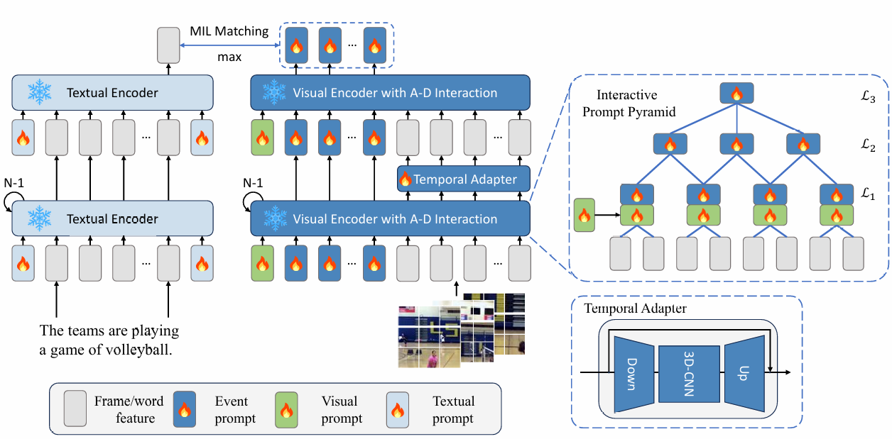

# ProPy: Building Interactive Prompt Pyramids upon CLIP for Partially Relevant Video Retrieval (EMNLP 2025 Findings)


<div align="center">
  
</div>

## Overview
We propose ProPy ([arxiv](https://arxiv.org/abs/2508.19024)), a model with systematic architectural adaption of CLIP specifically designed for PRVR.

## Installation

```
conda create -n propy python=3.10
conda activate propy
conda install pytorch==1.12.0 torchvision==0.13.0 cudatoolkit=11.3 -c pytorch
pip install -r requirements.txt
```

We use a single RTX 3090 GPU (Driver version: 535.113.01) to run all experiments. 

## Preparation
* Download raw videos of [Charades](https://ai2-public-datasets.s3-us-west-2.amazonaws.com/charades/Charades_v1.zip), [TVQA](https://nlp.cs.unc.edu/data/jielei/tvqa/tvqa_public_html/download_tvqa.html), [ActivityNet](http://activity-net.org/download.html) and [QVHighlights](https://nlp.cs.unc.edu/data/jielei/qvh/qvhilights_videos.tar.gz).
  * Note: You need to fill out forms for [TVQA](https://goo.gl/forms/HJiFJSllupqeCbax1) and [ActivityNet](https://docs.google.com/forms/d/e/1FAIpQLSdxhNVeeSCwB2USAfeNWCaI9saVT6i2hpiiizVYfa3MsTyamg/viewform) datasets.
* Compress downloaded videos to  *3fps* with width *224* using [scripts/prepare.sh](scripts/prepare.sh). 
  * Note: You need to modify corresponding paths in the script.
* Download annotations (we convert original annotations to a standard format) from [Baidu](https://pan.baidu.com/s/1BzQAaBhPOTH7d0pyAsbw8A?pwd=s2w5) or [Google](https://drive.google.com/drive/folders/1HZk1JnW50ZhYdFIcDXOscKe3QaSmGRoj?usp=drive_link) drive, and unzip them to `annotations` directory.
* Download pretrained CLIP-ViT-B/32 [weights](https://openaipublic.azureedge.net/clip/models/40d365715913c9da98579312b702a82c18be219cc2a73407c4526f58eba950af/ViT-B-32.pt) to `CLIP_weights` directory.

## Train 
Modify `video_dir` in `scripts/*.sh` according to your local directories, then run:
```
bash scripts/prvr_{split}.sh
bash scripts/vcmr_{split}.sh
```

Checkpoints will be saved to `logs/prvr_{split}` or `logs/vcmr_{split}`.

## Test
Modify the following parameters of same scripts to test models:

```
# for evaluation
do_train=0
do_eval=1
resume=/path/to/ckpt/ckpt.best.pth.tar

# then
bash scripts/prvr_{split}.sh
bash scripts/vcmr_{split}.sh
```

We provide all checkpoints and logs in [Baidu](https://pan.baidu.com/s/1BzQAaBhPOTH7d0pyAsbw8A?pwd=s2w5) and [Google](https://drive.google.com/drive/folders/1HZk1JnW50ZhYdFIcDXOscKe3QaSmGRoj?usp=drive_link) drives.

## Performance

### PRVR
  
|split|R@1|R@5|R@50|R@100|SumR|
|:-:|:-:|:-:|:-:|:-:|:-:|
|TVR|22.4|45.0|55.9|89.5|212.8|
|ActivityNet|14.9|34.9|47.5|82.7|180.0|
|Charades|2.6|8.7|14.8|50.4|76.5|
|QVHighlights-val|37.4|65.6|76.1|96.5|275.5|
|QVHighlights-test|35.0|63.2|73.1|96.2|267.5|

### Weakly-VCMR

|split|IoU=0.3,R@10|IoU=0.3,R@100|IoU=0.5,R@10|IoU=0.5,R@100|IoU=0.7,R@10|IoU=0.7,R@100|
|:-:|:-:|:-:|:-:|:-:|:-:|:-:|
|TVR|26.26|50.26|17.49|35.61|9.65|19.82|
|ActivityNet|28.57|57.42|20.81|46.22|12.94|31.85|
|Charades|6.8|23.39|4.73|18.44|2.26|9.01|
|QVHighlights-val|54.32|79.35|45.42|72.52|27.94|48.52|

## Visualization

To produce attention maps in Figure 4, run:

```
bash scripts/plot/plot_{split}.sh
```

These scripts will select videos based on R@1 metric, save necessary weights, then draw frame-level and event-level attention maps. Both weights and figures will be saved to `VIS/{split}`.

## Acknowledgements

This repo is built upon the following wonderful works:
* [DGL](https://github.com/knightyxp/DGL)
* [ms-sl](https://github.com/HuiGuanLab/ms-sl)
* [CLIP4Clip](https://github.com/ArrowLuo/CLIP4Clip)
* [st-adapter](https://github.com/linziyi96/st-adapter)
* [moment-detr](https://github.com/jayleicn/moment_detr)
